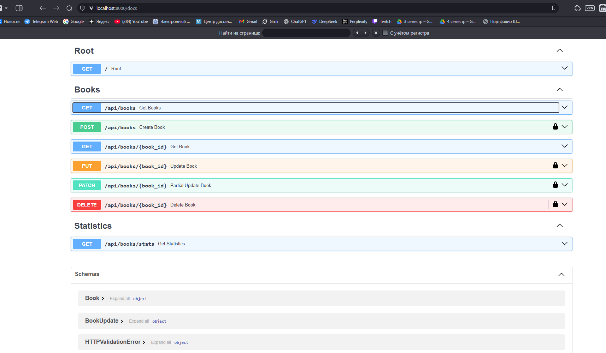
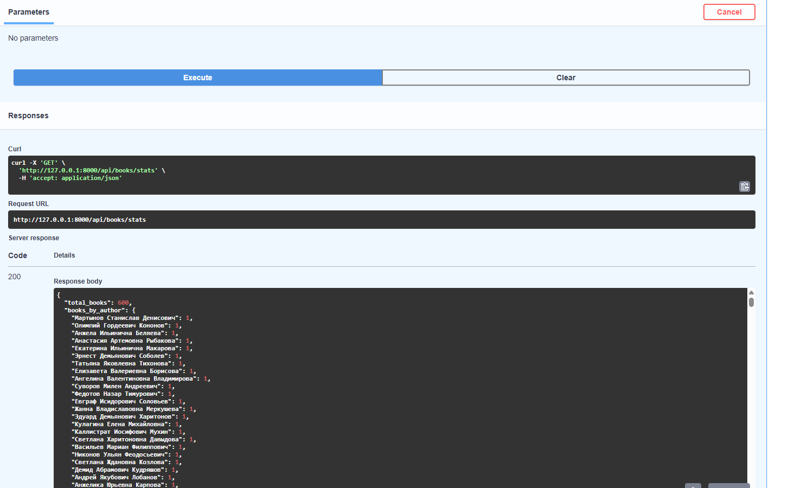
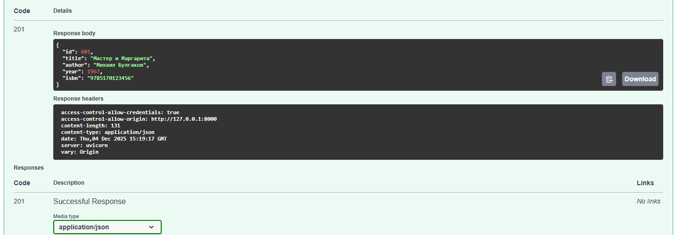

# Отчет по лабораторной работе
## Разработка REST API и работа с OpenAPI

---

### 1. Цель работы
Изучение принципов разработки RESTful API с использованием фреймворка FastAPI, автоматической генерации документации OpenAPI и тестирования API с помощью Swagger UI.

---

### 2. Теоретическая часть

**REST API** (Representational State Transfer) — это архитектурный стиль взаимодействия компонентов распределенного приложения в сети. Основные принципы REST:
1.  **Единообразный интерфейс**: унифицированный способ взаимодействия с ресурсами.
2.  **Клиент-сервер**: разделение ответственности между интерфейсом и хранением данных.
3.  **Отсутствие состояния (Stateless)**: сервер не хранит информацию о состоянии клиента между запросами.
4.  **Кэшируемость**: ответы могут быть помечены как кэшируемые.
5.  **Слоистая система**: клиент может взаимодействовать с сервером через промежуточные слои.
6.  **Код по требованию** (опционально): возможность передачи исполняемого кода клиенту.

**OpenAPI** — это спецификация для описания REST API. Она позволяет описывать доступные эндпоинты, форматы запросов и ответов, методы аутентификации и другие аспекты API в машиночитаемом формате (JSON или YAML).

**FastAPI** — это современный, быстрый веб-фреймворк для создания API на Python, основанный на стандартных подсказках типов Python. Он автоматически генерирует документацию OpenAPI и обеспечивает высокую производительность.

---

### 3. Практическая часть

В ходе лабораторной работы было разработано REST API для управления библиотекой книг ("Books API").

#### Реализованный функционал:
1.  **CRUD операции**:
    *   Создание книги (`POST /api/books`)
    *   Чтение списка книг (`GET /api/books`)
    *   Чтение одной книги (`GET /api/books/{id}`)
    *   Обновление книги (`PUT /api/books/{id}`)
    *   Частичное обновление (`PATCH /api/books/{id}`)
    *   Удаление книги (`DELETE /api/books/{id}`)
2.  **База данных**: Использована SQLite и ORM SQLAlchemy для хранения данных.
3.  **Валидация**: Использована библиотека Pydantic для валидации входных данных.
4.  **Аутентификация**: Реализована проверка API ключа (`X-API-Key`) для операций изменения данных.
5.  **Дополнительные функции**:
    *   Фильтрация по автору и году издания.
    *   Пагинация (параметры `skip` и `limit`).
    *   Статистика по книгам (`GET /api/books/stats`).

#### Фрагменты кода

**Модель данных (SQLAlchemy):**
```python
class BookDB(Base):
    __tablename__ = "books"
    id = Column(Integer, primary_key=True, index=True)
    title = Column(String(200), nullable=False)
    author = Column(String(100), nullable=False)
    year = Column(Integer, nullable=False)
    isbn = Column(String(13), nullable=True)
```

**Эндпоинт получения списка книг с фильтрацией и пагинацией:**
```python
@app.get("/api/books", response_model=List[Book], tags=["Books"])
async def get_books(
    skip: int = 0,
    limit: int = 10,
    author: Optional[str] = None,
    year_from: Optional[int] = None,
    year_to: Optional[int] = None,
    db: Session = Depends(get_db)
):
    query = db.query(BookDB)
    if author:
        query = query.filter(BookDB.author.ilike(f"%{author}%"))
    if year_from:
        query = query.filter(BookDB.year >= year_from)
    if year_to:
        query = query.filter(BookDB.year <= year_to)
    return query.offset(skip).limit(limit).all()
```

---

### 4. Результаты тестирования

Тестирование проводилось с использованием Swagger UI (`/docs`).



**Примеры запросов:**

1.  **Получение статистики:**
    *   Запрос: `GET /api/books/stats`
    *   Ответ:
        ```json
        {
          "total_books": 600,
          "books_by_author": { ... },
          "books_by_century": { "20 век": 150, "21 век": 450 }
        }
        ```



2.  **Создание книги (требует API Key):**
   {
  "id": 601,
  "title": "Мастер и Маргарита",
  "author": "Михаил Булгаков",
  "year": 1967,
  "isbn": "9785170123456"
}

---

### 5. Ответы на контрольные вопросы

1.  **Что такое REST и какие шесть принципов лежат в его основе?**
    REST — это архитектурный стиль для распределенных систем. 6 принципов: Единообразный интерфейс, Клиент-сервер, Отсутствие состояния (Stateless), Кэшируемость, Слоистая система, Код по требованию.

2.  **В чем разница между методами PUT и PATCH?**
    `PUT` предполагает полное обновление ресурса (клиент передает все поля, заменяя существующий объект). `PATCH` используется для частичного обновления (клиент передает только те поля, которые нужно изменить).

3.  **Что означает идемпотентность HTTP метода?**
    Идемпотентность означает, что повторное выполнение одного и того же запроса приводит к тому же состоянию сервера, что и однократное выполнение.
    *   Идемпотентные: `GET`, `PUT`, `DELETE`, `HEAD`, `OPTIONS`.
    *   Неидемпотентные: `POST` (каждый вызов создает новый ресурс).

4.  **Какие коды состояния HTTP используются?**
    *   Успех: `200 OK`, `201 Created`, `204 No Content`.
    *   Ошибка клиента: `400 Bad Request`, `401 Unauthorized`, `403 Forbidden`, `404 Not Found`, `422 Unprocessable Entity`.
    *   Ошибка сервера: `500 Internal Server Error`.

5.  **Что такое OpenAPI Specification?**
    Это стандарт описания REST API, позволяющий людям и инструментам понимать возможности сервиса без доступа к исходному коду.

6.  **В чем разница между OpenAPI и Swagger?**
    OpenAPI — это спецификация (стандарт), а Swagger — это набор инструментов (Swagger UI, Swagger Editor, Swagger Codegen) для работы с этой спецификацией.

7.  **Преимущества FastAPI?**
    Высокая производительность, автоматическая генерация документации (Swagger/ReDoc), валидация данных через Pydantic, поддержка асинхронности, типизация.

8.  **Что такое Pydantic?**
    Библиотека для валидации данных и управления настройками с использованием аннотаций типов Python. В FastAPI используется для описания схем запросов и ответов.

9.  **Как FastAPI генерирует документацию?**
    FastAPI анализирует аннотации типов в функциях-обработчиках и Pydantic модели, формирует JSON-схему OpenAPI и подключает Swagger UI для её визуализации.

10. **Что такое валидация данных?**
    Проверка входных данных на соответствие ожидаемому формату и правилам. Это важно для безопасности, целостности данных и предотвращения ошибок в работе приложения.

11. **Принцип stateless?**
    Сервер не хранит информацию о сессии клиента. Каждый запрос должен содержать всю необходимую информацию для его обработки (например, токен авторизации).

12. **Компоненты OpenAPI документа?**
    `info`, `servers`, `paths`, `components` (schemas, securitySchemes, etc.), `security`, `tags`.

13. **Обработка ошибок в FastAPI?**
    Используется `HTTPException`. Это исключение позволяет вернуть клиенту HTTP-ответ с кодом ошибки и описанием.

14. **Что такое HATEOAS?**
    Hypermedia as the Engine of Application State. Принцип, согласно которому сервер возвращает не только данные, но и ссылки на действия, которые можно выполнить с этими данными.

15. **Методы аутентификации?**
    Basic Auth, Bearer Token (JWT), API Keys, OAuth2, OpenID Connect.

---

### 6. Выводы
В ходе работы были изучены основы создания REST API на FastAPI. Реализовано полноценное приложение с базой данных, валидацией и документацией. Приобретены навыки работы с HTTP методами, статус-кодами и инструментами тестирования API.

---

### 7. Приложения
Полный исходный код программы находится в файлах `main.py`, `database.py`, `auth.py`.
