# Курс: Современные технологии программирования для образования

## Цели курса

1. Освоить современные технологии веб-разработки для создания образовательных материалов
2. Изучить методы работы с данными и их визуализации в образовательном контексте
3. Научиться автоматизировать рутинные задачи педагога с помощью программирования
4. Применить полученные знания для разработки практических инструментов для учебного процесса

## Компетенции

После прохождения курса студенты будут способны:
- Разрабатывать интерактивные веб-приложения для образовательных целей
- Обрабатывать и визуализировать данные об успеваемости учащихся
- Автоматизировать создание отчётов и документации
- Интегрировать современные IT-решения в учебный процесс
- Создавать цифровые образовательные ресурсы

## Структура курса

### Модуль 1: Веб-технологии в образовании (18 часов)
- Лекция - часть 1: Основы HTML5 и CSS3 для создания учебных материалов
- Лекция - часть 2: JavaScript и интерактивность на веб-страницах
- Лекция - часть 3: Создание образовательных веб-приложений с использованием фреймворков
- Практическая работа - часть 1: Создание интерактивной учебной страницы
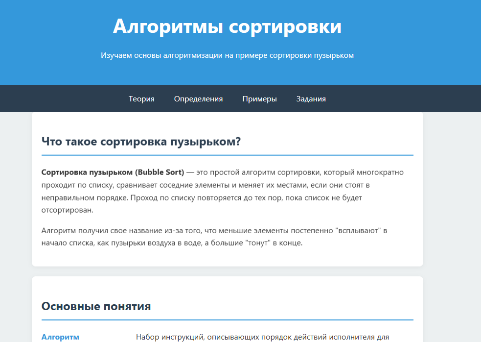
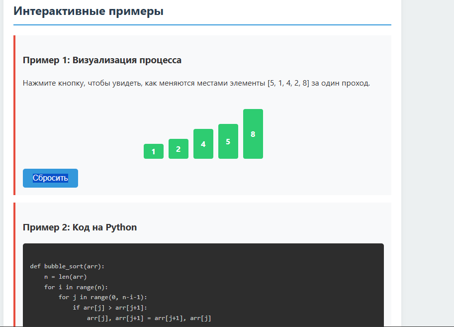
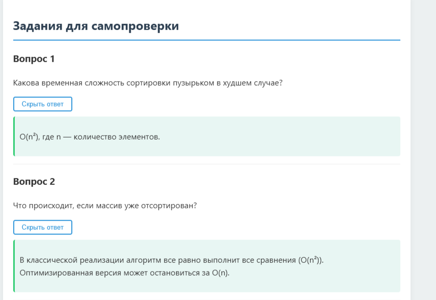
- Практическая работа - часть 2: Разработка онлайн-теста с проверкой ответов

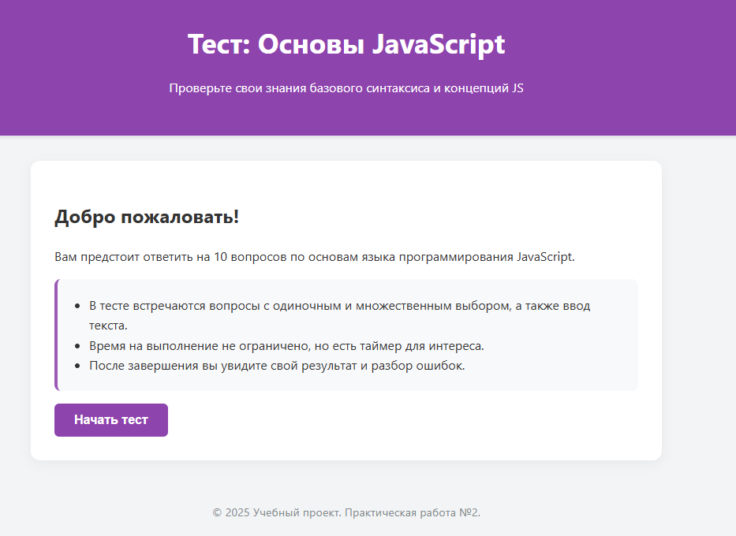
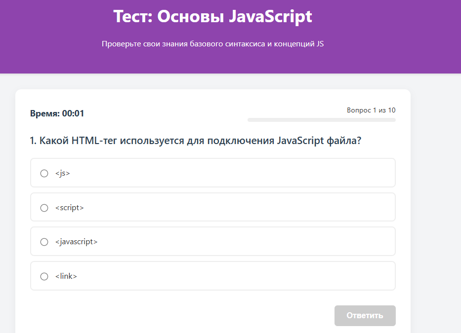
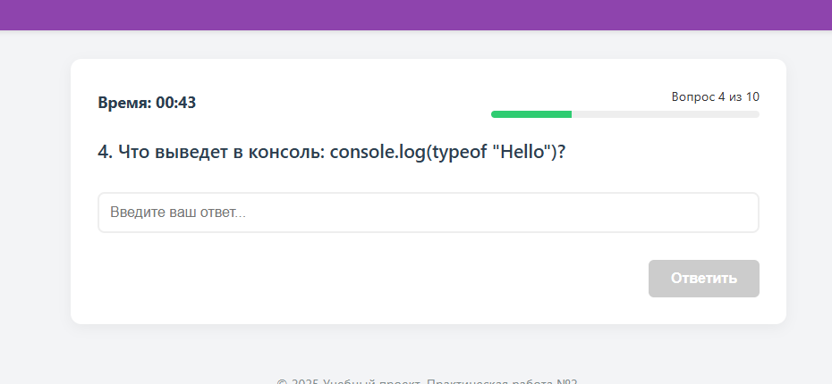
- Практическая работа - часть 3: Создание образовательной веб-игры

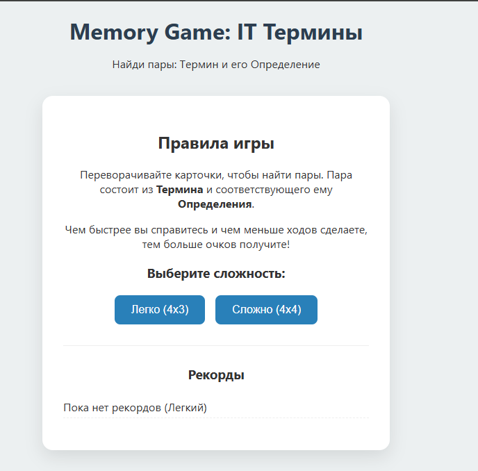
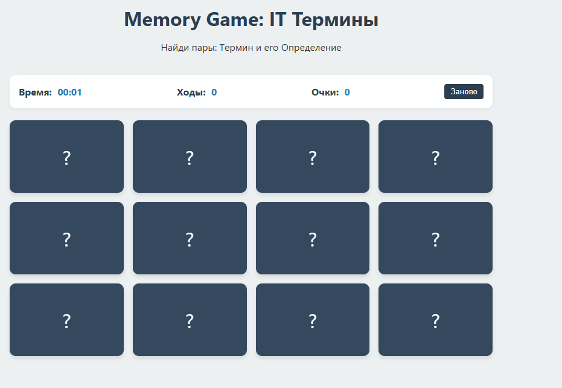
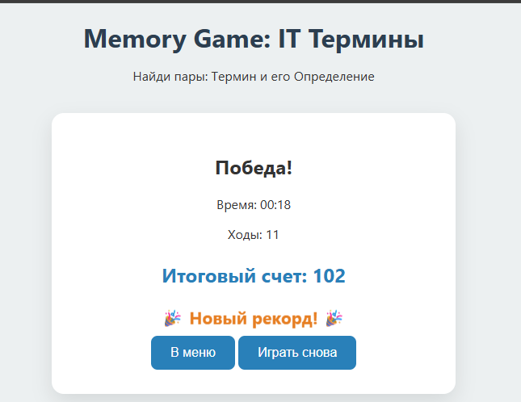

### Модуль 2: Работа с данными в образовательном процессе (18 часов)
- Лекция - часть 1: Основы работы с данными в Python
- Лекция - часть 2: Визуализация данных для образовательной аналитики
- Лекция - часть 3: Статистический анализ успеваемости учащихся
- Практическая работа - часть 1: Обработка журнала успеваемости

```================================================================================
ОТЧЁТ ПО УСПЕВАЕМОСТИ КЛАССА
Дата: 05.12.2025 18:36
================================================================================

ОБЩАЯ СТАТИСТИКА КЛАССА
--------------------------------------------------------------------------------
Всего учеников: 10
Средний балл класса: 4.12
Медиана: 4.20
Стандартное отклонение: 0.66
Минимальный балл: 3.00
Максимальный балл: 5.00

РАСПРЕДЕЛЕНИЕ УЧЕНИКОВ
--------------------------------------------------------------------------------
Отличников: 4 (40.0%)
Хорошистов: 4 (40.0%)
Троечников: 2 (20.0%)
Требуют внимания: 0 (0.0%)

СТАТИСТИКА ПО ПРЕДМЕТАМ
--------------------------------------------------------------------------------

Математика:
  Средний балл: 4.10
  Медиана: 4.00
  Стд. отклонение: 0.88
  Мин/Макс: 3 / 5

Русский:
  Средний балл: 4.10
  Медиана: 4.00
  Стд. отклонение: 0.74
  Мин/Макс: 3 / 5

Физика:
  Средний балл: 4.00
  Медиана: 4.00
  Стд. отклонение: 0.82
  Мин/Макс: 3 / 5

Информатика:
  Средний балл: 4.40
  Медиана: 4.50
  Стд. отклонение: 0.70
  Мин/Макс: 3 / 5

История:
  Средний балл: 4.00
  Медиана: 4.00
  Стд. отклонение: 0.82
  Мин/Макс: 3 / 5

================================================================================
ТОП-5 ЛУЧШИХ УЧЕНИКОВ
--------------------------------------------------------------------------------
1. Козлова А.В.: 5.00 (Отличник)
2. Новикова Е.П.: 4.80 (Отличник)
3. Иванов И.И.: 4.60 (Отличник)
4. Соколов В.П.: 4.60 (Отличник)
5. Петрова М.А.: 4.40 (Хорошист)

================================================================================
⚠️  УЧЕНИКИ, ТРЕБУЮЩИЕ ВНИМАНИЯ
--------------------------------------------------------------------------------
  • Сидоров П.С.: 3.40
  • Фёдоров А.Н.: 3.00

================================================================================
Конец отчёта
================================================================================
```

- Практическая работа - часть 2: Создание дашборда для мониторинга успеваемости


- Практическая работа - часть 3: Анализ результатов тестирования и формирование отчётов

```plaintext
================================================================================
АНАЛИТИЧЕСКИЙ ОТЧЁТ ПО РЕЗУЛЬТАТАМ КОНТРОЛЬНОЙ РАБОТЫ
Дата: 05.12.2025 18:45
================================================================================

1. ОБЩАЯ СТАТИСТИКА
--------------------------------------------------------------------------------
Количество учеников: 25
Количество заданий: 15
Средний результат класса: 62.9%
Медиана: 60.0%
Лучший результат: 80.0%
Худший результат: 46.7%

Распределение:
  Отлично (≥85%): 0 чел. (0%)
  Хорошо (70-84%): 8 чел. (32%)
  Удовл. (50-69%): 14 чел. (56%)
  Не справились (<50%): 3 чел. (12%)

2. ПРОБЛЕМНЫЕ ЗАДАНИЯ (успеваемость < 60%)
--------------------------------------------------------------------------------

Задание_6:
  Тема: Теорема Пифагора
  Правильно ответили: 14/25 (56%)
  Сложность: Средне

Задание_9:
  Тема: Тригонометрия
  Правильно ответили: 14/25 (56%)
  Сложность: Средне

Задание_12:
  Тема: Логарифмы
  Правильно ответили: 10/25 (40%)
  Сложность: Сложно

Задание_13:
  Тема: Производная
  Правильно ответили: 10/25 (40%)
  Сложность: Сложно

Задание_14:
  Тема: Производная
  Правильно ответили: 9/25 (36%)
  Сложность: Сложно

Задание_15:
  Тема: Производная
  Правильно ответили: 11/25 (44%)
  Сложность: Сложно

3. АНАЛИЗ ТЕМ
--------------------------------------------------------------------------------
Темы, требующие дополнительной проработки:

  Производная: 40%
  Логарифмы: 59%

4. УЧЕНИКИ, НУЖДАЮЩИЕСЯ В ПОМОЩИ (результат < 50%)
--------------------------------------------------------------------------------
  Ученик_7: 7 баллов (46.7%)
  Ученик_19: 7 баллов (46.7%)
  Ученик_20: 7 баллов (46.7%)

5. РЕКОМЕНДАЦИИ
--------------------------------------------------------------------------------
📚 Провести дополнительные занятия по темам:
   - Производная
   - Логарифмы

👥 Организовать дополнительные консультации для 3 учеников

================================================================================
Конец отчёта
================================================================================
```

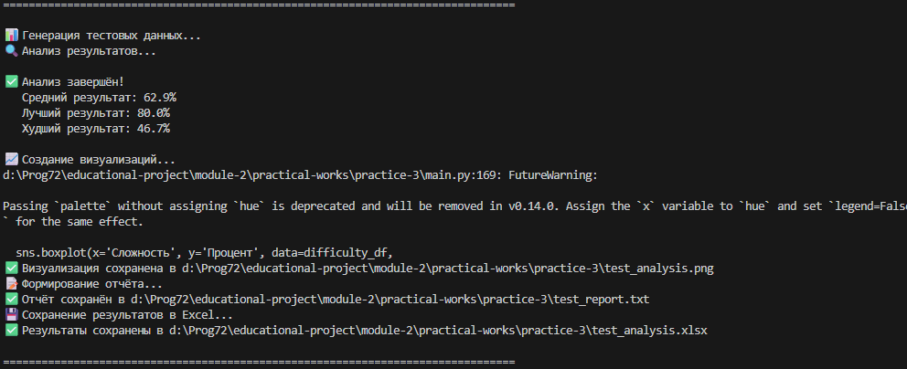
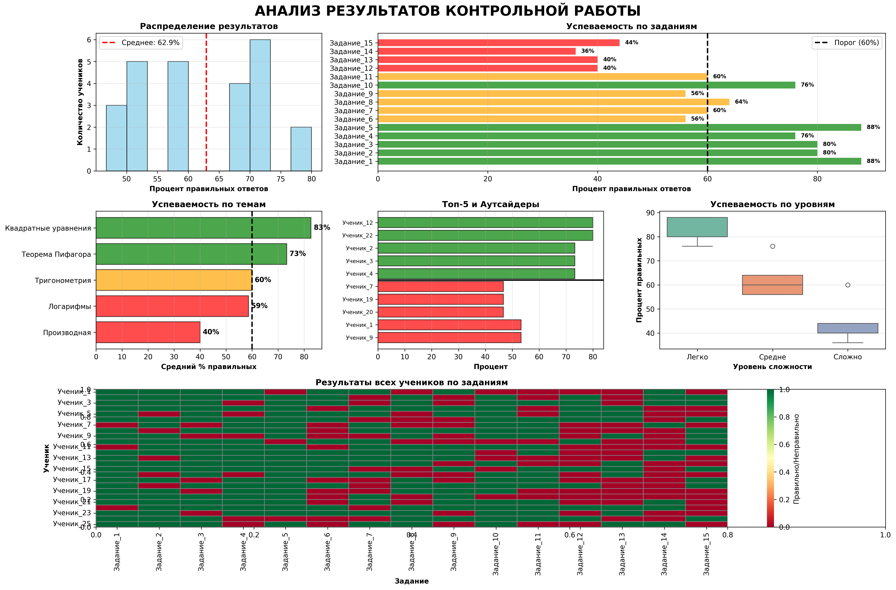

### Модуль 3: Автоматизация педагогических задач (18 часов)
- Лекция - часть 1: Автоматизация работы с документами
- Лекция - часть 2: Создание ботов для образовательных платформ
- Лекция - часть 3: Интеграция различных образовательных сервисов
- Практическая работа - часть 1: Автоматическое генерирование заданий и тестов
- Практическая работа - часть 2: Создание Telegram-бота для взаимодействия с учащимися
- Практическая работа - часть 3: Разработка системы автоматического уведомления родителей

## Методология преподавания

- **Лекции:** Теоретический материал с демонстрацией примеров
- **Практические работы:** Самостоятельное выполнение проектов с применением изученных технологий
- **Форматы работы:** Индивидуальная и групповая работа
- **Оценивание:** Защита практических работ, итоговый проект

## Требования к входным знаниям

- Базовые знания программирования (Python или JavaScript)
- Понимание основ работы с компьютером и интернетом
- Знакомство с HTML/CSS на базовом уровне

## Технические требования

- Компьютер с доступом в интернет
- Установленные инструменты: Python 3.8+, Node.js, текстовый редактор (VS Code)
- Браузер (Chrome, Firefox)
- Git для контроля версий

